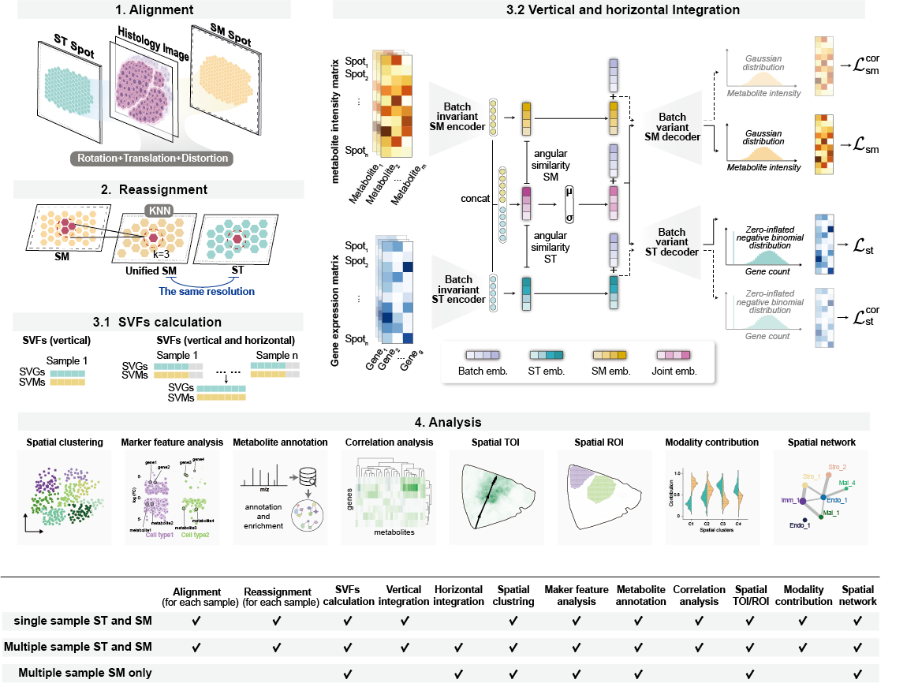

# SpatialMETA

spatialMETA is a method for integrating spatial multi-omics data. SMOI aligns ST and SM to a unified resolution, integrates single or multiple sample data to identify cross-modal spatial patterns, and offers extensive visualization and analysis functions.



## Documentation

[Documentation](https://spatialmeta.readthedocs.io/en/latest/)

## Installation
Recommended to use Python 3.11+ environment.

### Installing via PyPI
```shell
pip3 install spatialmeta
```

### Installing from source with uv (Recommended)
```shell
# For new projects - clone and install as dependency

# For existing uv projects - add as dependency
uv add git+https://github.com/imessien/SpatialMETA.git

# For development - clone and install in editable mode
git clone https://github.com/imessien/SpatialMETA.git
cd SpatialMETA
uv sync
```

`

## Change Log
- 0.1.0 (2025-01-XX)
  - Migrated to uv package manager for modern Python dependency management
  - Updated all dependencies to latest versions (PyTorch 2.8.0+, Transformers 4.56.2+, etc.)
  - Added support for Python 3.11+
  - Added transformers, diffusers, and gradio as optional dependencies
  - Improved installation process with pyproject.toml
  - Updated README with new installation instructions
- 0.0.2 (2025-03-06)
  - Update `spatialmeta.model.AlignmentModule` 
  - Update `spatialmeta.model.ConditionalVAESTSM`