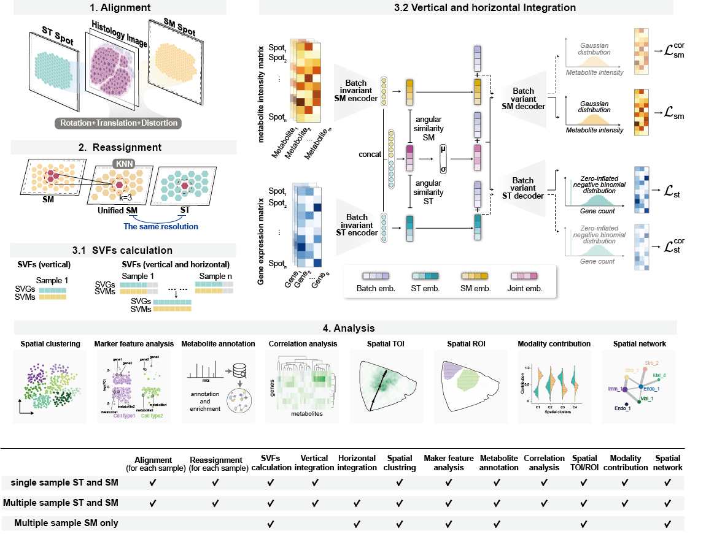

.. spatialMETA documentation master file, created by Ruonan Tian
   You can adapt this file completely to your liking, but it should at least
   contain the root `toctree` directive.

Welcome to spatialMETA's documentation!
============================================
spatialMETA is a method for integrating spatial multi-omics data. spatialMETA aligns ST and SM to a unified resolution, integrates single or multiple sample data to identify cross-modal spatial patterns, and offers extensive visualization and analysis functions.

.. toctree::
   :maxdepth: 4
   :caption: Contents:

Contents
--------

.. toctree::
   install
   tutorial
   api

